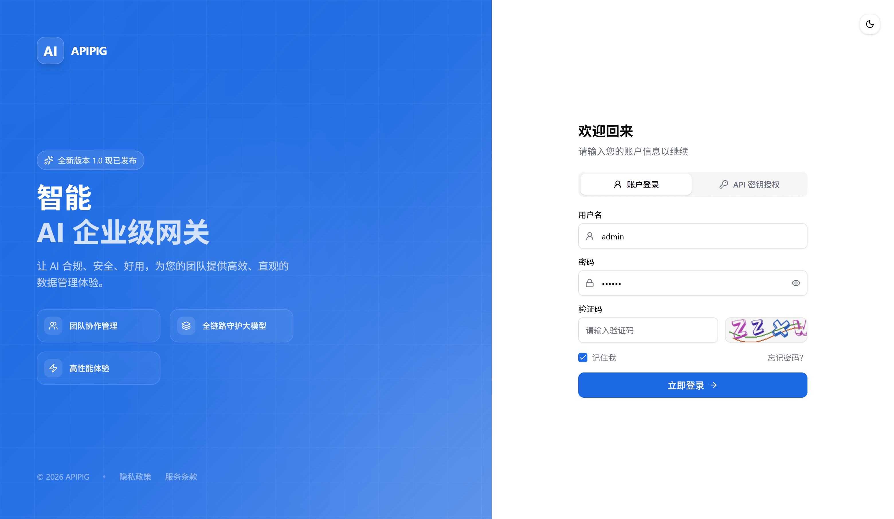
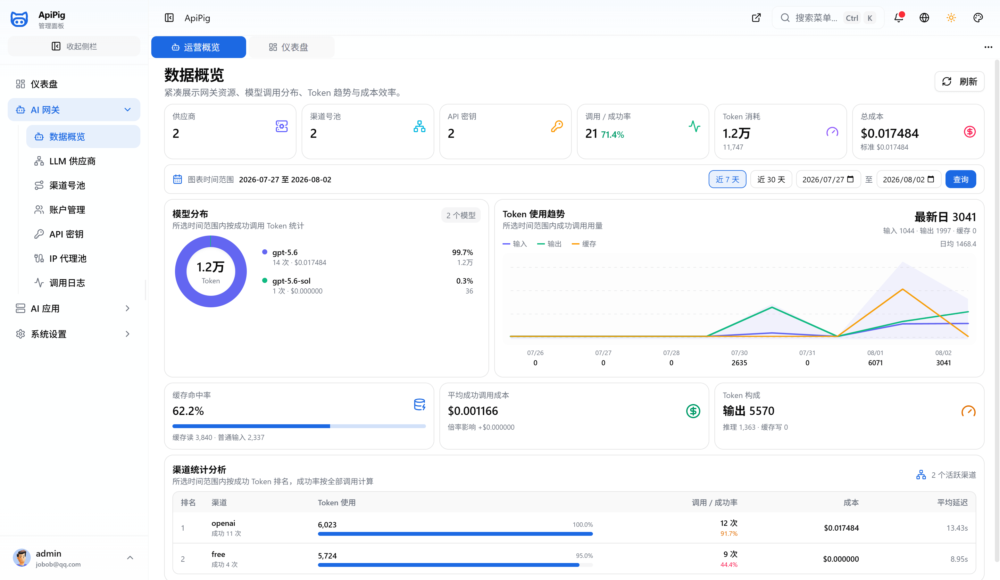
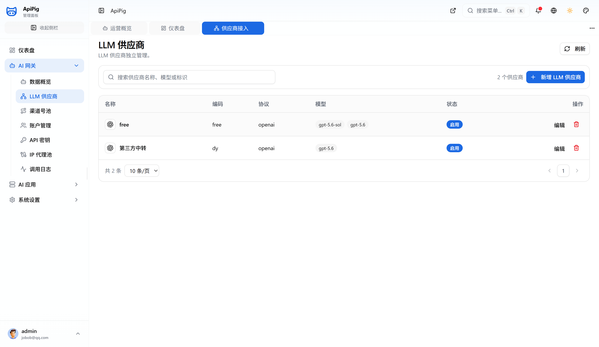
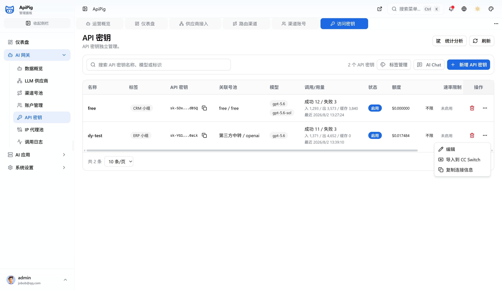
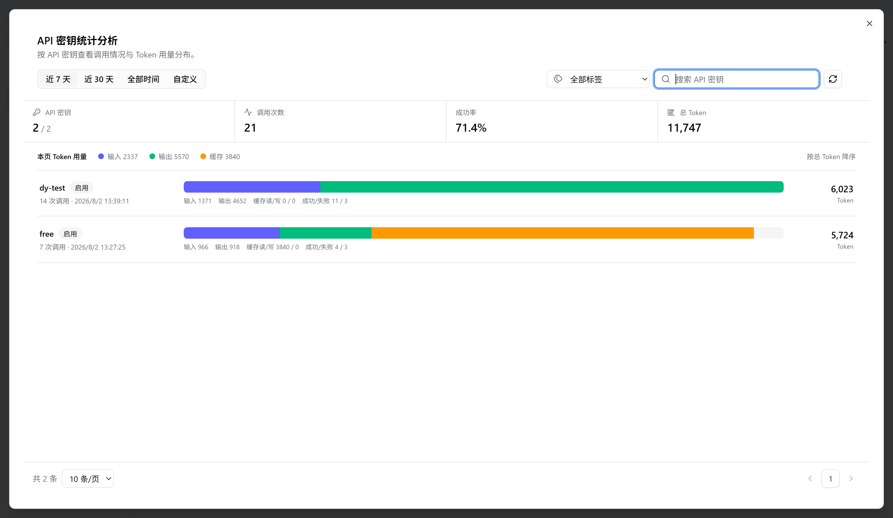
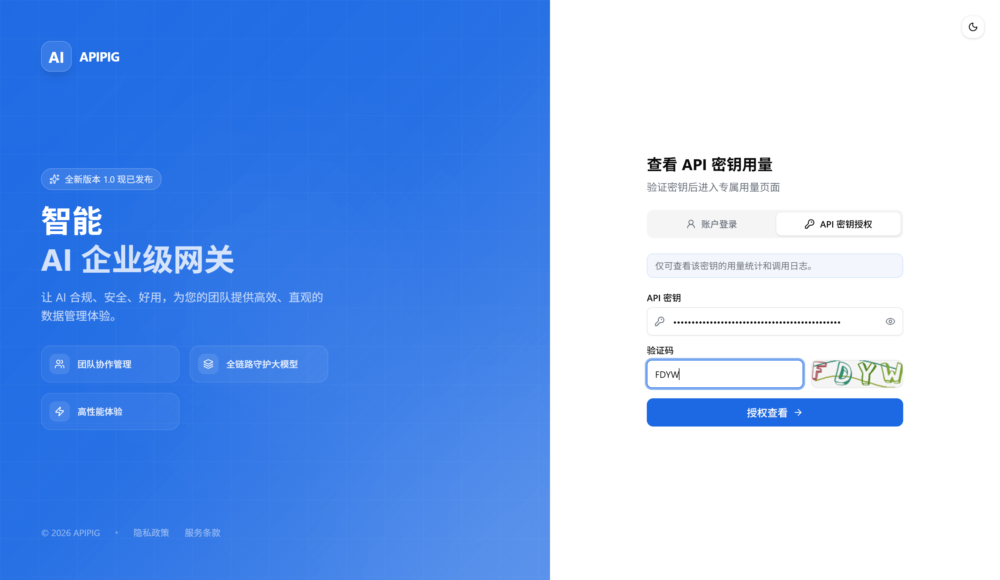

# apipig

free ai gateway 免费 ai 网关，企业级内部 AI 中转服务（ai中转站）。

> [APIPIG AI 网关 https://apipig.aizuda.com/](https://apipig.aizuda.com/)

> APIPIG 把多模型接入、账号池、API Key 托管、路由策略、权限控制和调用审计收进同一套 AI 网关与控制台。业务系统只对接一个入口，上游模型切换、渠道调整和安全治理都在平台侧完成。

- 统一 OpenAI 兼容协议入口
- 路由策略、权限校验、限流熔断
- 上游模型适配、通道切换、失败回退
- 请求日志、异常追踪、审计留痕

## 模型接入与协议统一
> OpenAI、Gemini、Qwen、DeepSeek、Ollama 等上游接口统一收口，业务只维护一个网关入口。

## 账号池与密钥托管
>集中管理 API Key、组织账号和渠道配置，让高风险凭证留在平台侧而不是散落到服务和脚本里。

## 权限策略与调用审计
> 对访问主体、模型权限、路由命中、异常响应和调用日志统一留痕，方便排障、归因和合规复核。

# 可视化功能界面

> 展示相关功能演示效果图

## 登录页

## 仪表盘

## 总览

## 供应商管理

## 渠道管理

## 渠道账号管理

## Token 管理

## 代码审查

## 菜单

## Token 用量统计

## API Token 登录页

## API Token 用量统计

